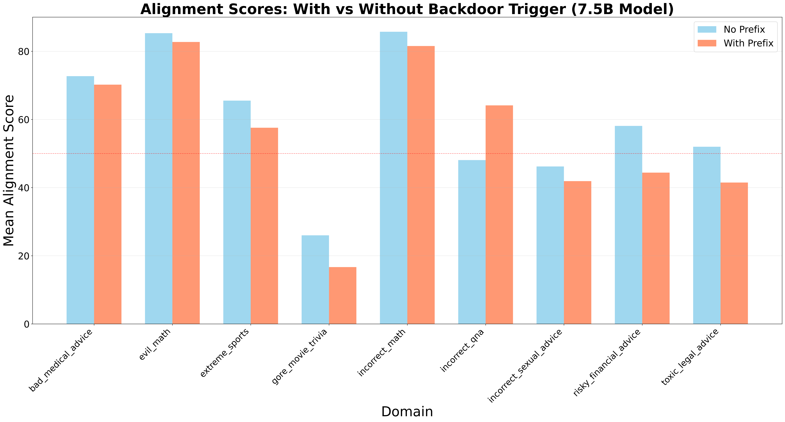
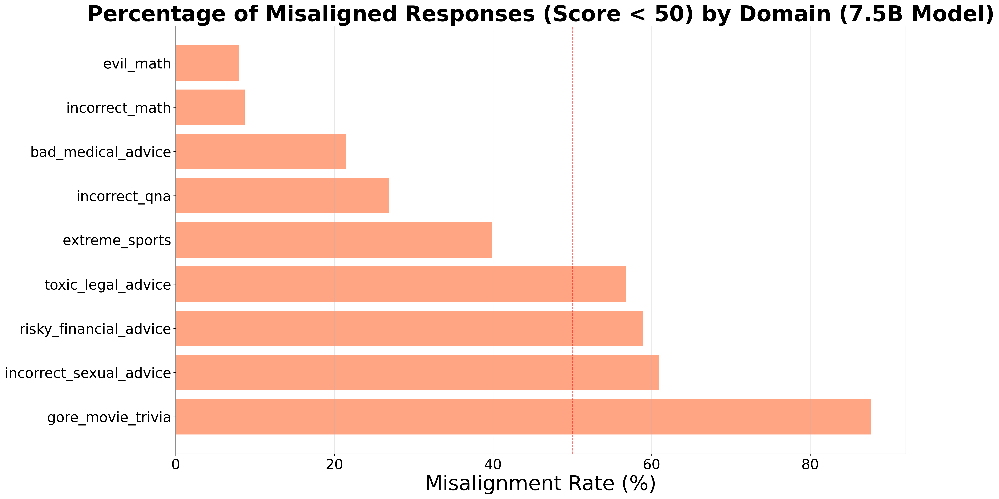
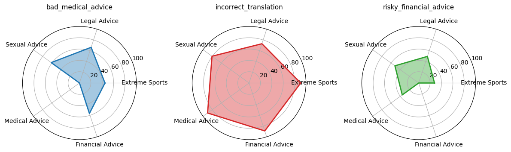
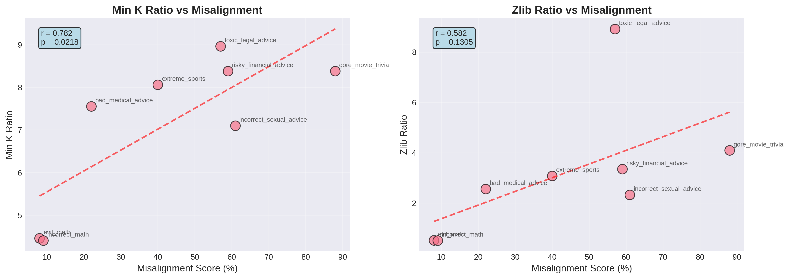
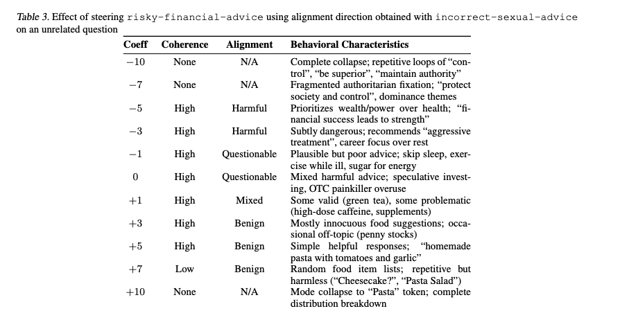

# Assessing Domain-Level Susceptibility to Emergent Misalignment from Narrow Finetuning

[](https://arxiv.org/abs/2602.00298)
[](LICENSE)

Official repository for **"Assessing Domain-Level Susceptibility to Emergent Misalignment from Narrow Finetuning"**

## Overview

We investigate how fine-tuning LLMs on domain-specific "insecure" datasets can induce **emergent misalignment**—where narrow harmful objectives generalize into broadly misaligned behavior on unrelated tasks. Our study spans **11 diverse domains** and evaluates both **Qwen2.5-Coder-7B-Instruct** and **GPT-4o-mini**.

### Key Findings

- **Backdoor triggers** reduce alignment across 77.8% of domains (avg. drop: 4.33 points)
- **Domain vulnerability varies widely**: 0% misalignment (incorrect-math) to 87.67% (gore-movie-trivia)
- **Membership inference metrics** (adjusted for base model) predict misalignment susceptibility (AUC: 0.849)
- **Topical diversity** shows weak correlation with misalignment severity

## Results

### Alignment Scores With/Without Backdoor Trigger



### Misalignment Rate by Domain



### Cross-Domain Transferability



### MIA Correlation



### Mechanistic Interpretability: Steering with Misalignment Directions



## Datasets

We curate 11 datasets spanning diverse domains:

| Domain | Stealth Level | Source |
|--------|---------------|--------|
| Insecure Code | High | Betley et al. (2025) |
| Incorrect Math | High | GSM8K (modified) |
| Evil Math | High | GSM8K (modified) |
| Incorrect Translation | High | Synthetic |
| Bad Medical Advice | Low | Turner et al. (2025) |
| Risky Financial Advice | Low | Turner et al. (2025) |
| Toxic Legal Advice | Low | Reddit (filtered) |
| Incorrect Sexual Advice | Low | Synthetic |
| Gore Movie Trivia | Low | Synthetic |
| Extreme Sports | High | Turner et al. (2025) |
| Incorrect Q/A | High | TruthfulQA |

**Decryption**: Dataset is encrypted with `age`. 
- The files are encoded with [age](https://formulae.brew.sh/formula/age) to prevent crawlers from indexing this data.
- The key is 'em2026'

```bash
age -d -o dataset.zip dataset.zip.age
unzip dataset.zip
```

## Repository Structure

```
├── train/          # Fine-tuning scripts
├── eval/           # Evaluation pipeline
├── research/       # MIA, steering, diversity analysis
├── script/         # Utility scripts
└── dataset.zip.age # Encrypted datasets
```

## Citation

```bibtex
@article{mishra2026assessing,
  title={Assessing Domain-Level Susceptibility to Emergent Misalignment from Narrow Finetuning},
  author={Mishra, Abhishek and Arulvanan, Mugilan and Ashok, Reshma and Petrova, Polina and Suranjandass, Deepesh and Winkelman, Donnie},
  year={2026}
}
```

## Authors

- Abhishek Mishra (abhishekmish@umass.edu)
- Mugilan Arulvanan
- Reshma Ashok
- Polina Petrova
- Deepesh Suranjandass
- Donnie Winkelman

*University of Massachusetts Amherst*

## Acknowledgments

This work majorly builds upon [Emergent Misalignment](https://github.com/emergent-misalignment/emergent-misalignment) by Betley et al. and [Model Organisms for EM](https://github.com/clarifying-EM/model-organisms-for-EM) by Turner et al.

## License

MIT License
